# **Java开发者LLM实战—LangChain4j**

### 介绍

LangChain4j官网：https://docs.langchain4j.dev/

LangChain4j 的目标是简化与 Java 应用程序 集成大模型。

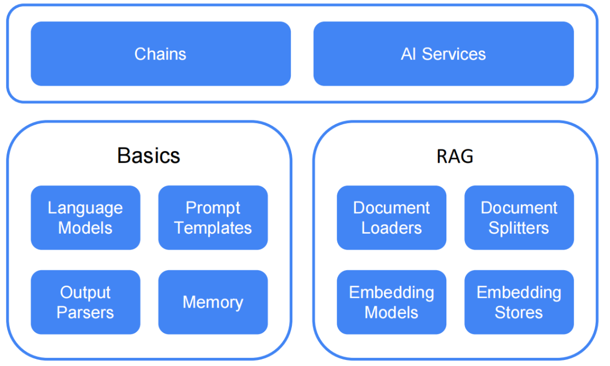

#### 特性：

**统一 API**： LLM提供程序（如 OpenAI 或 阿里百炼）和嵌入（向量）存储（如 redis 或 ES） 使用专有 API。LangChain4j 提供了一个统一的 API，以避免为每个 API 学习和实现特定的 API。 要试验不同的LLMs存储或嵌入的存储，您可以在它们之间轻松切换，而无需重新编写代码。 LangChain4j 目前支持的[热门LLM](https://docs.langchain4j.dev/integrations/language-models/)和  [嵌入模型。](https://docs.langchain4j.dev/integrations/embedding-stores/)

**LangChain4j vs SpringAI**

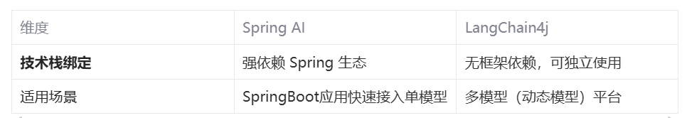


### 初识LangChain4j(纯java)

新建一个Maven工程，然后引入了langchain4j的核心依赖、langchain4j集成OpenAi各个模型的依赖。

```java
<?xml version="1.0" encoding="UTF-8"?>
<project xmlns="http://maven.apache.org/POM/4.0.0"
         xmlns:xsi="http://www.w3.org/2001/XMLSchema-instance"
         xsi:schemaLocation="http://maven.apache.org/POM/4.0.0 http://maven.apache.org/xsd/maven-4.0.0.xsd">
    <modelVersion>4.0.0</modelVersion>
    
    <groupId>com.xs</groupId>
    <artifactId>langchain4j-demo</artifactId>
    <version>1.0-SNAPSHOT</version>


    <properties>
        <java.version>17</java.version>
        <langchain4j.version>1.0.0-beta1</langchain4j.version>
    </properties>

    <dependencies>
        <dependency>
            <groupId>dev.langchain4j</groupId>
            <artifactId>langchain4j</artifactId>
            <version>${langchain4j.version}</version>
        </dependency>
        <dependency>
            <groupId>dev.langchain4j</groupId>
            <artifactId>langchain4j-open-ai</artifactId>
            <version>${langchain4j.version}</version>
        </dependency> 
    </dependencies>

</project>
```


#### 和OpenAi的第一次对话

```java
package com.xs.langchain4j_demos;

import dev.langchain4j.model.chat.ChatLanguageModel;
import dev.langchain4j.model.openai.OpenAiChatModel;
import org.junit.jupiter.api.Test;
import org.springframework.boot.test.context.SpringBootTest;

class Langchain4jDemosApplicationTests {

    @Test
    void test01() {
        ChatLanguageModel model = OpenAiChatModel
                .builder()
                .apiKey("demo")
                .modelName("gpt-4o-mini")
                .build();

        String answer = model.chat("你好，你是谁？");

        System.out.println(answer);
    }

}
```

运行代码结果


你会发现，  LangChain4j 对于初次接入大模型的开发者来说十分友好，不需要指定模型，不需要指定apikey, 即可对接大模型进行对话，这是怎么做到的呢？

其实我们对ApiKey为"demo" ， 底层会做这些事情：

```java
public OpenAiChatModel(String baseUrl, String apiKey, String organizationId, String modelName, Double temperature, Double topP, List<String> stop, Integer maxTokens, Double presencePenalty, Double frequencyPenalty, Map<String, Integer> logitBias, String responseFormat, Integer seed, String user, Duration timeout, Integer maxRetries, Proxy proxy, Boolean logRequests, Boolean logResponses, Tokenizer tokenizer) {
	
	baseUrl = (String)Utils.getOrDefault(baseUrl, "https://api.openai.com/v1");
	if ("demo".equals(apiKey)) {
		baseUrl = "http://langchain4j.dev/demo/openai/v1";
	}

	//其他代码
}
```

在底层在构造OpenAiChatModel时，会判断传入的ApiKey是否等于"demo"，如果等于会将OpenAi的原始API地址"https://api.openai.com/v1"改为"http://langchain4j.dev/demo/openai/v1"，这个地址是langchain4j专门为我们准备的一个体验地址，实际上这个地址相当于是"https://api.openai.com/v1"的代理，我们请求代理时，代理会去调用真正的OpenAi接口，只不过代理会将自己的ApiKey传过去，从而拿到结果返回给我们。

所以，真正开发时，需要大家设置自己的apiKey或baseUrl，可以这么设置：

```java
ChatLanguageModel model = OpenAiChatModel.builder()
	.baseUrl("http://langchain4j.dev/demo/openai/v1")
	.apiKey("demo")
	.build();
```


#### 接入deepseek

```JAVA

    /**
     * 测试基本对话——接入deepseek
     */
    @Test
    void test02() {
        ChatLanguageModel model = OpenAiChatModel
                .builder()
                .baseUrl("https://api.deepseek.com")
                .apiKey(System.getenv("DEEP_SEEK_KEY"))
                .modelName("deepseek-chat")
                .build();

        String answer = model.chat("你好，你是谁？");

        System.out.println(answer);
    }
```

文生图WanxImageModel

```JAVA
@Test
public void test() {
    WanxImageModel wanxImageModel = WanxImageModel.builder()
    .modelName("wanx2.1-t2i-plus")
    .apiKey(System.getenv("ALI_AI_KEY"))
    .build();

    Response<Image> response = wanxImageModel.generate("美女");
    System.out.println(response.content().url());
}	
```

文生语音

```java
package com.xs.langchain4j_demos;

import com.alibaba.dashscope.audio.ttsv2.SpeechSynthesisParam;
import com.alibaba.dashscope.audio.ttsv2.SpeechSynthesizer;

import java.io.File;
import java.io.FileOutputStream;
import java.io.IOException;
import java.nio.ByteBuffer;

public class AudioTest {
    private static String model = "cosyvoice-v1";
    private static String voice = "longxiaochun";

    public static void streamAuidoDataToSpeaker() {
        SpeechSynthesisParam param =
                SpeechSynthesisParam.builder()
                        // 若没有将API Key配置到环境变量中，需将下面这行代码注释放开，并将your-api-key替换为自己的API Key
                        .apiKey(System.getenv("ALI_AI_KEY"))
                        .model(model)
                        .voice(voice)
                        .build();
        SpeechSynthesizer synthesizer = new SpeechSynthesizer(param, null);
        ByteBuffer audio = synthesizer.call("大家好我是徐庶？");
        File file = new File("output.mp3");
        try (FileOutputStream fos = new FileOutputStream(file)) {
            fos.write(audio.array());
        } catch (IOException e) {
            throw new RuntimeException(e);
        }
    }

    public static void main(String[] args) {
        streamAuidoDataToSpeaker();
        System.exit(0);
    }
}
```


### 整合SpringBoot

先引入SpringBoot：

```xml
<parent>        
    <groupId>org.springframework.boot</groupId>         
    <artifactId>spring-boot-starter-parent</artifactId>         
    <version>3.4.3</version>         
    <relativePath/>       
</parent>
```

#### 接入百炼

  官网：  [DashScope (Qwen) | LangChain4j](https://docs.langchain4j.dev/integrations/language-models/dashscope/)

```xml
<dependencies>
    <dependency>
        <groupId>dev.langchain4j</groupId>
        <artifactId>langchain4j-community-dashscope-spring-boot-starter</artifactId>
    </dependency>
    <dependency>
        <groupId>org.springframework.boot</groupId>
        <artifactId>spring-boot-starter-web</artifactId>
    </dependency>
    <dependency>
        <groupId>org.springframework.boot</groupId>
        <artifactId>spring-boot-starter-test</artifactId>
        <scope>test</scope>
    </dependency>
</dependencies>

<dependencyManagement>
    <dependencies>
        <dependency>
            <groupId>dev.langchain4j</groupId>
            <artifactId>langchain4j-community-bom</artifactId>
            <version>${langchain4j.version}</version>
            <type>pom</type>
            <scope>import</scope>
        </dependency>
    </dependencies>
</dependencyManagement>

```

Controller：

```java
package com.xs.langchain4j_demos.controller;

import dev.langchain4j.model.chat.ChatLanguageModel;
import org.springframework.beans.factory.annotation.Autowired;
import org.springframework.web.bind.annotation.RequestMapping;
import org.springframework.web.bind.annotation.RequestParam;
import org.springframework.web.bind.annotation.RestController;

@RestController
@RequestMapping("/ai")
public class AiController {

    @Autowired
    ChatLanguageModel qwenChatModel;


    @RequestMapping("/chat")
    public String test(@RequestParam(defaultValue="你是谁") String message) {
        String chat = qwenChatModel.chat(message);
        return chat;
    }
}

```

配置通义千问-Max模型：

```properties
langchain4j.community.dashscope.chatModel.apiKey=${ALI_AI_KEY} langchain4j.community.dashscope.chatModel.modelName=qwen-plus
```

访问http://localhost:8080/ai/chat：

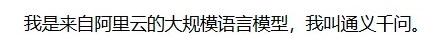


###### 配置deepseek模型

```properties
langchain4j.community.dashscope.chatModel.apiKey=${DEEPSEEK_API_KEY}
langchain4j.community.dashscope.chatModel.modelName=deepseek-r1
```

访问http://localhost:8080/ai/chat：

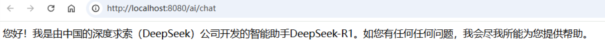


#### 接入Ollama

关于Ollama的本地部署：   [DeepSeek本地部署教程](https://www.yuque.com/geren-t8lyq/ncgl94/gq3pk5phzfe77fc2)

官网[Ollama | LangChain4j](https://docs.langchain4j.dev/integrations/language-models/ollama/)

```xml
<!--Ollama-->         
<dependency>             
    <groupId>dev.langchain4j</groupId>         
    <artifactId>langchain4j-ollama-spring-boot-starter</artifactId>                  		<version>${langchain4j.version}</version>     
</dependency>"

```

Controller：

```java
package com.xs.langchain4j_demos.controller;

import dev.langchain4j.model.chat.ChatLanguageModel;
import org.springframework.beans.factory.annotation.Autowired;
import org.springframework.web.bind.annotation.RequestMapping;
import org.springframework.web.bind.annotation.RequestParam;
import org.springframework.web.bind.annotation.RestController;

@RestController
@RequestMapping("/ai")
public class AiController {

  
    @Autowired
    ChatLanguageModel ollamaChatModel;


    @RequestMapping("/chat_ollama")
    public String chatOllama(@RequestParam(defaultValue="你是谁") String message) {
        String chat = ollamaChatModel.chat(message);
        return chat;
    }
}

```

###### 配置deepseek模型

  同上


#### 流式输出

因为langchain4j不是spring家族， 所以我们在wen应用中需要引入webflux

```xml
<dependency>       
    <groupId>org.springframework.boot</groupId>       
    <artifactId>spring-boot-starter-webflux</artifactId>     
</dependency>
```

通过Flux进行流式响应

```java

@RestController
@RequestMapping("/ai_other")
public class OtherAIController {

    @Autowired
    StreamingChatLanguageModel qwenStreamingChatModel;


    @RequestMapping(value = "/stream_chat",produces ="text/stream;charset=UTF-8")
    public Flux<String> test(@RequestParam(defaultValue="你是谁") String message) {
        return Flux.create(sink -> {
            qwenStreamingChatModel.chat(message, new StreamingChatResponseHandler() {
                @Override
                public void onPartialResponse(String partialResponse) {
                    sink.next(partialResponse);  // 逐次返回部分响应
                }

                @Override
                public void onCompleteResponse(ChatResponse completeResponse) {
                    sink.complete();  // 完成整个响应流
                }

                @Override
                public void onError(Throwable error) {
                    sink.error(error);  // 异常处理
                }
            });
        });
    }
}
```

langchain4j毕竟不是spring家族， 和spring生态一起用真蹩脚。  还是springai舒服


#### 记忆对话(多轮对话）

##### 原生方式

每次对话都需要将之前的对话记录，都发给大模型， 这样才能知道我们之前说了什么

```java
     /**
     * 测试多轮对话——正确用法
     */
    @Test
    void test03_good() {
        ChatLanguageModel model = OpenAiChatModel
                .builder()
                .apiKey("demo")
                .modelName("gpt-4o-mini")
                .build();


        UserMessage userMessage1 = UserMessage.userMessage("你好，我是徐庶");
        ChatResponse response1 = model.chat(userMessage1);
        AiMessage aiMessage1 = response1.aiMessage(); // 大模型的第一次响应
        System.out.println(aiMessage1.text());
        System.out.println("----");

        // 下面一行代码是重点
        ChatResponse response2 = model.chat(userMessage1, aiMessage1, UserMessage.userMessage("我叫什么"));
        AiMessage aiMessage2 = response2.aiMessage(); // 大模型的第二次响应
        System.out.println(aiMessage2.text());

    }
```

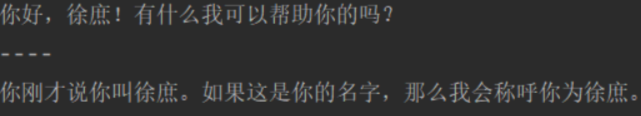

但是如果要我们每次把之前的记录自己去维护， 未免太麻烦， 所以提供了ChatMemory

但是他这个ChatMemory没有SpringAi好用、易用， 十分麻烦！

##### 通过ChatMemory

```java

@Configuration
public class AiConfig {

    public interface Assistant {
        String chat(String message);
        // 流式响应
        TokenStream stream(String message);
    }

    @Bean
    public Assistant assistant(ChatLanguageModel qwenChatModel,
                               StreamingChatLanguageModel qwenStreamingChatModel) {
        ChatMemory chatMemory = MessageWindowChatMemory.withMaxMessages(10);


        Assistant assistant = AiServices.builder(Assistant.class)
                .chatLanguageModel(qwenChatModel)
                .streamingChatLanguageModel(qwenStreamingChatModel)
                .chatMemory(chatMemory)
                .build();

        return  assistant;
    }
}
```

原理：

通过AiService创建的代理对象调用chat方法

1、代理对象会去ChatMemory中获取之前的对话记录（获取记忆）

2、将获取到的对话记录合并到当前对话中（此时大模型根据之前的聊天记录肯定就拥有了“记忆”）

3、将当前的对话内容存入ChatMemory（保存记忆）

Controller:

```java
@RestController
@RequestMapping("/ai_other")
public class OtherAIController { 
    @Autowired
    AiConfig.Assistant assistant;
    
    @RequestMapping(value = "/memory_chat")
    public String memoryChat(@RequestParam(defaultValue="我叫徐庶") String message) {
        return assistant.chat(message);
    }

}


     @RequestMapping(value = "/memory_stream_chat",produces ="text/stream;charset=UTF-8")
    public Flux<String> memoryStreamChat(@RequestParam(defaultValue="我是谁") String message, HttpServletResponse response) {
        TokenStream stream = assistant.stream(message);

        return Flux.create(sink -> {
            stream.onPartialResponse(s -> sink.next(s))
                    .onCompleteResponse(c -> sink.complete())
                    .onError(sink::error)
                    .start();

        });
    }
```

我们通过2种接口体验记忆对话

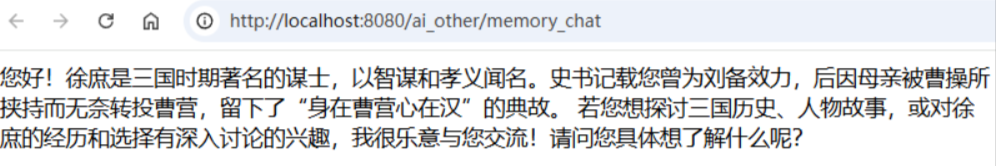


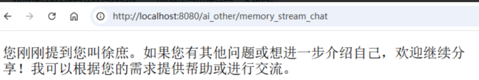


##### 记忆分离

现在我们再来想另一种情况：  如果不同的用户或者不同的对话肯定不能用同一个记忆，要不然对话肯定会混淆，此时就需要进行区分：

可以通过**memoryId**进行区分，**memoryId**可以设置为用户Id, 或者对话Id  进行区分即可：

```java

    @Autowired
    AiConfig.AssistantUnique assistantUnique;

    @RequestMapping(value = "/memoryId_chat")
    public String memoryChat(@RequestParam(defaultValue="我是谁") String message, Integer userId) {
        return assistantUnique.chat(userId,message);
    }

```

##### 持久化对话

如果要对记忆的数据进行持久化呢？ 因为现在的数据其实是存在内存中， 重启就丢了。

可以配置一个**ChatMemoryStore** ， 默认是InMemoryChatMemoryStore——通过一个map进行存储。

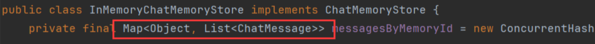

所以如果需要持久化到第三方存储， 可以重新配置ChatMemoryStore 。

1、自定义ChatMemoryStore实现类：

```java
public class PersistentChatMemoryStore implements ChatMemoryStore {

        private final Map<Integer, List<ChatMessage>> map =new HashMap<>();

        @Override
        public List<ChatMessage> getMessages(Object memoryId) {
            // todo 根据memoryId从数据库获取
        }

        @Override
        public void updateMessages(Object memoryId, List<ChatMessage> messages) {
            // todo 根据memoryId修改、新增记录
        }

        @Override
        public void deleteMessages(Object memoryId) {
           // todo 根据memoryId删除
        }
    }
```

2、配置ChatMemoryStore

```java
    @Bean
    public AssistantUnique assistantUniqueStore(ChatLanguageModel qwenChatModel,
                                           StreamingChatLanguageModel qwenStreamingChatModel) {

        PersistentChatMemoryStore store = new PersistentChatMemoryStore();

        ChatMemoryProvider chatMemoryProvider = memoryId -> MessageWindowChatMemory.builder()
                .id(memoryId)
                .maxMessages(10)
                .chatMemoryStore(store)
                .build();

        AssistantUnique assistant = AiServices.builder(AssistantUnique.class)
                .chatLanguageModel(qwenChatModel)
                .streamingChatLanguageModel(qwenStreamingChatModel)
                .chatMemoryProvider(memoryId ->
                        MessageWindowChatMemory.builder().maxMessages(10)
                                .id(memoryId).build()
                )
                .chatMemoryProvider(chatMemoryProvider)
                .build();
        return assistant;
```


#### Function-call（Tools）

对于基础大模型来说， 他只具备通用信息，他的参数都是拿公网进行训练，并且有一定的时间延迟，  无法得知一些具体业务数据和实时数据， 这些数据往往被各软件系统存储在自己数据库中.

比如我现在开发一个智能票务助手，  我现在跟AI说需要退票， AI怎么做到呢？  就需要让AI调用我们自己系统的退票业务方法，进行操作数据库。

那这些都可以通过function-call进行完成，更多的用于实现类似智能客服场景，因为客服需要帮用户解决业务问题（就需要调用业务方法）。

function-call的流程：

 比如： 我现在需要当对话中用户问的是“长沙有多少个叫什么名字”的对话， 我需要去我程序中获取"

1. 问大模型 ”长沙有多少个叫徐庶的”

2. 大模型在识别到你的问题是： “长沙有多少个叫什么名字”

3. 大模型提取“徐庶”

4. 调用changshaNameCount方法

5. 通过返回的结果再结合上下文再次请求大模型

6. 响应“长沙有xx个叫徐庶的”

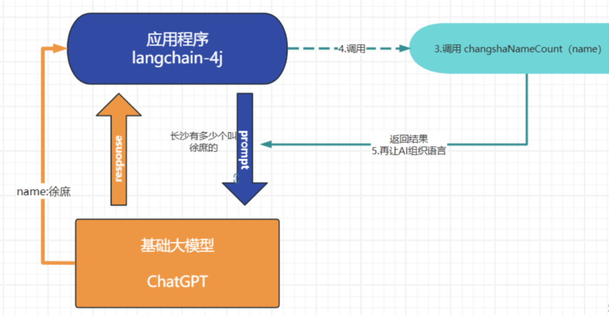

##### 实现

1、加入回调方法：

```java

@Service
public class ToolsService {

    @Tool("长沙有多少个名字的")
    public  Integer changshaNameCount(
            @P("姓名")
            String name){
        System.out.println(name);
        return 10;
    }
}

```

 ToolsService配置为了一个bean

 @Tool  用于告诉AI什么对话调用这个方法

 @P("姓名")  用于告诉AI ，调用方法的时候需要提取对话中的什么信息， 这里提取的是姓名

2、结合通过AiService配置tools ， 这里用的是前面记忆对话时配置的Assistant

```java
 public interface Assistant {
        String chat(String message);
        // 流式响应
        TokenStream stream(String message);
    }

    @Bean
    public Assistant assistant(ChatLanguageModel qwenChatModel,
                               StreamingChatLanguageModel qwenStreamingChatModel,
                               ToolsService toolsService) {
        ChatMemory chatMemory = MessageWindowChatMemory.withMaxMessages(10);


        Assistant assistant = AiServices.builder(Assistant.class)
                .chatLanguageModel(qwenChatModel)
                .streamingChatLanguageModel(qwenStreamingChatModel)
                .tools(toolsService)
                .chatMemory(chatMemory)
                .build();

        return  assistant;
    }
```

所以， 你如果需要加更多的tool.  只需要在TollsService中加， 比如：   

```java
    @Tool("长沙的天气")
    public  String changshaWeather( ){
        System.out.println("长沙的天气");
        return "下雪";
    }
```

 这个langchan4j封装得倒是挺易用的


#### 预设角色（系统消息SystemMessage）

基础大模型是没有目的性的， 你聊什么给什么， 但是如果我们开发的事一个智能票务助手， 我需要他以一个票务助手的角色跟我对话，  并且在我跟他说"退票"的时候，  让大模型一定要告诉我“车次”和"姓名"  ，这样我才能去调用业务方法（假设有一个业务方法，需要根据车子和姓名才能查询具体车票），进行退票。

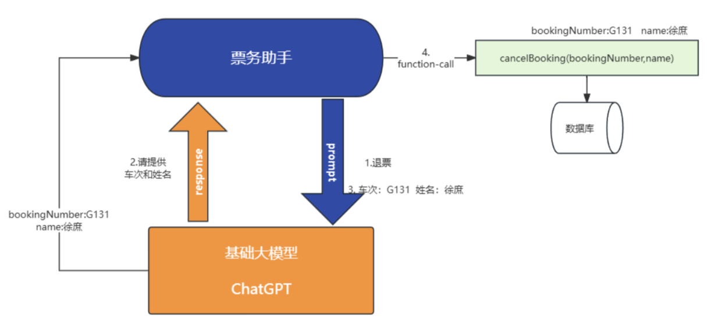

在langchain4j中实现也非常简单

 ●  @SystemMessage 系统消息， 一般做一些预设角色的提示词，设置大模型的基本职责

 ● 可以通过{{current_date}} 传入参数，  因为预设词中的文本可能需要实时变化

 ● @V("current_date")， 通过@V传入{{}}中的参数

 ● 一旦参数不止一个， 就需要通过@UserMessage设置用户信息

```java
public interface Assistant {
        String chat(String message);
        // 流式响应

        TokenStream stream(String message);
        @SystemMessage("""
                您是“Tuling”航空公司的客户聊天支持代理。请以友好、乐于助人且愉快的方式来回复。
                        您正在通过在线聊天系统与客户互动。 
                        在提供有关预订或取消预订的信息之前，您必须始终从用户处获取以下信息：预订号、客户姓名。
                        请讲中文。
					   今天的日期是 {{current_date}}.
                """)
        TokenStream stream(@UserMessage String message,@V("current_date") String currentDate);
    }


  @RequestMapping(value = "/memory_stream_chat",produces ="text/stream;charset=UTF-8")
    public Flux<String> memoryStreamChat(@RequestParam(defaultValue="我是谁") String message, HttpServletResponse response) {
        TokenStream stream = assistant.stream(message, LocalDate.now().toString());

        return Flux.create(sink -> {
            stream.onPartialResponse(s -> sink.next(s))
                    .onCompleteResponse(c -> sink.complete())
                    .onError(sink::error)
                    .start();

        });
    }
```

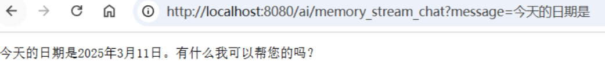


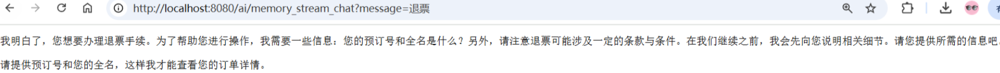


另外：假设大模型不支持系统消息（一般都支持），可以用@UserMessage代替@SystemMessage

```java
interface Friend {
    @UserMessage("你是一个航空智能助手，你需要帮助用户进行服务： {{it}}")
    String chat(String userMessage);
}
```


### RAG

[ArXiv论文](https://arxiv.org/html/2312.10997v5)

检索增强生成（Retrieval-augmented Generation)

对于基础大模型来说， 他只具备通用信息，他的参数都是拿公网进行训练，并且有一定的时间延迟，  无法得知一些具体业务数据和实时数据， 这些数据往往在各种文件中（比如txt、word、html、数据库...）

虽然function-call、SystemMessage可以用来解决一部分问题， 但是它只能少量， 如果你要提供大量的业务领域信息，  就需要给他外接一个知识库。

```
比如
 1. 我问他退订要多少费用
 2. 这些资料可能都由产品或者需求编写在了文档中  
 a. 所以需要现在需求信息存到向量数据库（这个过程叫Embedding， 涉及到文档读取、分词、向量化存入）
 3. 去向量数据库中查询“退订费用相关信息”
 4. 将查询到的数据和对话信息再请求大模型
 5. 此时会响应退订需要多少费用
```

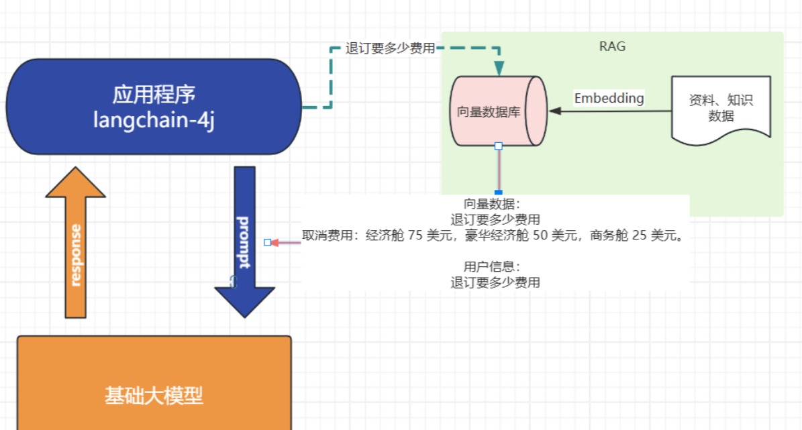

#### 

#### 向量

```
向量通常用来做相似性搜索，比如语义的一维向量，可以表示词语或短语的语义相似性。例如，“你好”、“hello”和“见到你很高兴”可以通过一维向量来表示它们的语义接近程度。
```

然而，对于更复杂的对象，比如小狗，无法仅通过一个维度来进行相似性搜索。这时，我们需要提取多个特征，如颜色、大小、品种等，将每个特征表示为向量的一个维度，从而形成一个多维向量。例如，一只棕色的小型泰迪犬可以表示为一个多维向量 [棕色, 小型, 泰迪犬]。

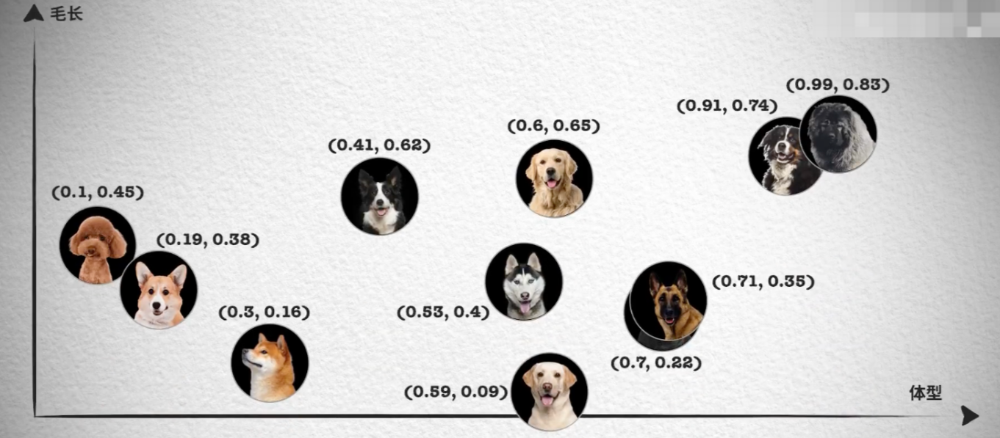

如果需要检索见过更加精准， 我们肯定还需要更多维度的向量， 组成更多维度的空间，在多维向量空间中，相似性检索变得更加复杂。我们需要使用一些算法，如余弦相似度或欧几里得距离，来计算向量之间的相似性。向量数据库会帮我实现。

#### 文本向量化

LangChain4j中来调用向量模型来对一句话进行向量化体验:

```java
package com.xs;

import dev.langchain4j.data.embedding.Embedding;
import dev.langchain4j.data.message.AiMessage;
import dev.langchain4j.data.message.UserMessage;
import dev.langchain4j.model.chat.ChatLanguageModel;
import dev.langchain4j.model.openai.OpenAiChatModel;
import dev.langchain4j.model.openai.OpenAiEmbeddingModel;
import dev.langchain4j.model.output.Response;


public class _05_Vector {

    public static void main(String[] args) {

        QwenEmbeddingModel  embeddingModel= QwenEmbeddingModel.builder()
                .apiKey(System.getenv("ALI_AI_KEY"))
                .build();

        Response<Embedding> embed = embeddingModel.embed("你好，我叫徐庶");
        System.out.println(embed.content().toString());
		System.out.println(embed.content().vector().length);
        
    }
}

```

代码执行结果为：

```java
mbedding { vector = [0.014577684, 0.007282357, 0.030037291, -0.02028425, ...
1536
```

从结果可以知道"你好，我叫徐庶"这句话经过OpenAiEmbeddingModel向量化之后得到的一个长度为1536的float数组。注意，1536是固定的，不会随着句子长度而变化。

那么，我们通过这种向量模型得到一句话对应的向量有什么作用呢？非常有用，因为我们可以基于向量来判断两句话之间的相似度，举个例子：

 查询跟秋田犬类似的狗，  在向量数据库中根据每个狗的特点进行多维向量， 你会发现秋田犬的向量数值和柴犬的向量数值最接近， 就可以查到类似的狗。    （当然我这里只是举例，让你对向量数据库有一个印象）

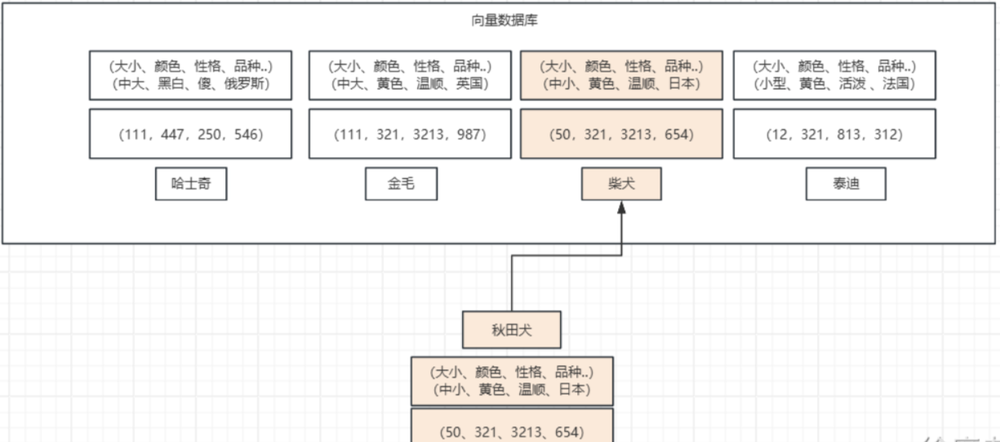

#### 向量数据库

对于向量模型生成出来的向量，我们可以持久化到向量数据库，并且能利用向量数据库来计算两个向量之间的相似度，或者根据一个向量查找跟这个向量最相似的向量。

 在LangChain4j中，EmbeddingStore表示向量数据库，它有支持[20+ 嵌入模型](https://docs.langchain4j.dev/integrations/embedding-stores/)

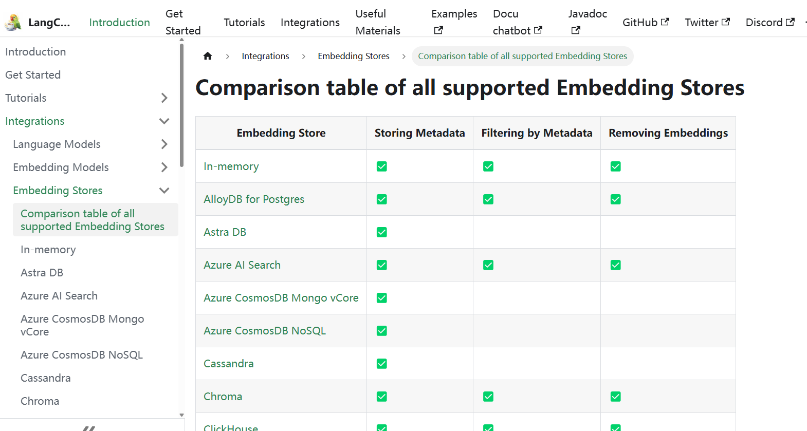

其中有我们熟悉的几个数据库都可以用来存储向量，比如Elasticsearch、MongoDb、Neo4j、Pg、Redis。"

Redis也很简单， 你需要先安装redis7.0+的版本：

```xml
<dependency> 	
    <groupId>dev.langchain4j</groupId> 
    <artifactId>langchain4j-redis</artifactId> 
    <version>${langchain4j.version}</version>
</dependency>
```

然后需要注意的是，普通的Redis是不支持向量存储和查询的，需要额外的redisearch模块，我这边是直接使用docker来运行一个带有redisearch模块的redis容器的，命令为：

```shell
docker run -p 6379:6379 redis/redis-stack-server:latest
```

注意端口6379不要和你现有的Redis冲突了。然后就可以使用以下代码把向量存到redis中了。

```java
RedisEmbeddingStore embeddingStore = RedisEmbeddingStore.builder()
    .host("127.0.0.1")
    .port(6379)
    .dimension(1536)
    .build();

// 生成向量
Response<Embedding> embed = embeddingModel.embed("我是徐庶");

// 存储向量
embeddingStore.add(embed.content());
```

dimension表示要存储的向量的维度，所以为1536，如果你不是使用OpenAiEmbeddingModel得到的向量，那么维度可能会不一样。


#### 匹配向量

在这个示例中， 我分别存储了预订航班和取消预订2段说明到向量数据库中，然后通过"退票要多少钱" 进行查询。

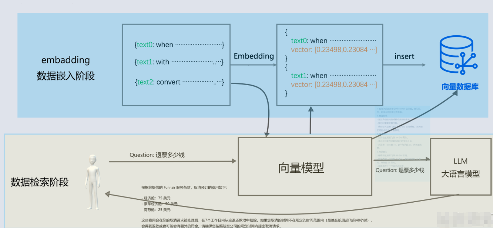


```java
    @Test
    public void test02()  {
        InMemoryEmbeddingStore<TextSegment> embeddingStore = new InMemoryEmbeddingStore<>();

        QwenEmbeddingModel  embeddingModel= QwenEmbeddingModel.builder()
                .apiKey(System.getenv("ALI_AI_KEY"))
                .build();

        // 利用向量模型进行向量化， 然后存储向量到向量数据库
        TextSegment segment1 = TextSegment.from("""
                预订航班:
                - 通过我们的网站或移动应用程序预订。
                - 预订时需要全额付款。
                - 确保个人信息（姓名、ID 等）的准确性，因为更正可能会产生 25 的费用。
                """);
        Embedding embedding1 = embeddingModel.embed(segment1).content();
        embeddingStore.add(embedding1, segment1);

        // 利用向量模型进行向量化， 然后存储向量到向量数据库
        TextSegment segment2 = TextSegment.from("""
                取消预订:
                - 最晚在航班起飞前 48 小时取消。
                - 取消费用：经济舱 75 美元，豪华经济舱 50 美元，商务舱 25 美元。
                - 退款将在 7 个工作日内处理。
                """);
        Embedding embedding2 = embeddingModel.embed(segment2).content();
        embeddingStore.add(embedding2, segment2);


        // 需要查询的内容 向量化
        Embedding queryEmbedding = embeddingModel.embed("退票要多少钱").content();

        // 去向量数据库查询
        // 构建查询条件
        EmbeddingSearchRequest build = EmbeddingSearchRequest.builder()
                .queryEmbedding(queryEmbedding)
                .maxResults(1)
                .build();

        // 查询
        EmbeddingSearchResult<TextSegment> segmentEmbeddingSearchResult = embeddingStore.search(build);
        segmentEmbeddingSearchResult.matches().forEach(embeddingMatch -> {
            System.out.println(embeddingMatch.score()); // 0.8144288515898701
            System.out.println(embeddingMatch.embedded().text()); // I like football.
        });

    }

```

代码执行结果为

```java
0.7319455553039915
取消预订:
- 最晚在航班起飞前 48 小时取消。
- 取消费用：经济舱 75 美元，豪华经济舱 50 美元，商务舱 25 美元。
- 退款将在 7 个工作日内处理。
```

由于我设置的是返回结果数量为1， 所以他会返回匹配度分数最高的那段内容.   如果返回结果数量为2. 其实预订航班那段也会查出来， 但是他的匹配度分数更低也没有太大的意义。


#### 知识库RAG