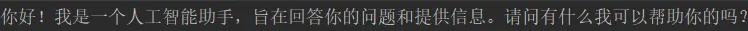

# **Java开发者LLM实战—LangChain4j**

### 介绍

LangChain4j官网：https://docs.langchain4j.dev/

LangChain4j 的目标是简化与 Java 应用程序 集成大模型。


#### 特性：

**统一 API**： LLM提供程序（如 OpenAI 或 阿里百炼）和嵌入（向量）存储（如 redis 或 ES） 使用专有 API。LangChain4j 提供了一个统一的 API，以避免为每个 API 学习和实现特定的 API。 要试验不同的LLMs存储或嵌入的存储，您可以在它们之间轻松切换，而无需重新编写代码。 LangChain4j 目前支持的[热门LLM](https://docs.langchain4j.dev/integrations/language-models/)和  [嵌入模型。](https://docs.langchain4j.dev/integrations/embedding-stores/)

**LangChain4j vs SpringAI**


### 初识LangChain4j(纯java)

新建一个Maven工程，然后引入了langchain4j的核心依赖、langchain4j集成OpenAi各个模型的依赖。

```java
<?xml version="1.0" encoding="UTF-8"?>
<project xmlns="http://maven.apache.org/POM/4.0.0"
         xmlns:xsi="http://www.w3.org/2001/XMLSchema-instance"
         xsi:schemaLocation="http://maven.apache.org/POM/4.0.0 http://maven.apache.org/xsd/maven-4.0.0.xsd">
    <modelVersion>4.0.0</modelVersion>
    
    <groupId>com.xs</groupId>
    <artifactId>langchain4j-demo</artifactId>
    <version>1.0-SNAPSHOT</version>


    <properties>
        <java.version>17</java.version>
        <langchain4j.version>1.0.0-beta1</langchain4j.version>
    </properties>

    <dependencies>
        <dependency>
            <groupId>dev.langchain4j</groupId>
            <artifactId>langchain4j</artifactId>
            <version>${langchain4j.version}</version>
        </dependency>
        <dependency>
            <groupId>dev.langchain4j</groupId>
            <artifactId>langchain4j-open-ai</artifactId>
            <version>${langchain4j.version}</version>
        </dependency> 
    </dependencies>

</project>
```


#### 和OpenAi的第一次对话

```java
package com.xs.langchain4j_demos;

import dev.langchain4j.model.chat.ChatLanguageModel;
import dev.langchain4j.model.openai.OpenAiChatModel;
import org.junit.jupiter.api.Test;
import org.springframework.boot.test.context.SpringBootTest;

class Langchain4jDemosApplicationTests {

    @Test
    void test01() {
        ChatLanguageModel model = OpenAiChatModel
                .builder()
                .apiKey("demo")
                .modelName("gpt-4o-mini")
                .build();

        String answer = model.chat("你好，你是谁？");

        System.out.println(answer);
    }

}
```

运行代码结果



你会发现，  LangChain4j 对于初次接入大模型的开发者来说十分友好，不需要指定模型，不需要指定apikey, 即可对接大模型进行对话，这是怎么做到的呢？

其实我们对ApiKey为"demo" ， 底层会做这些事情：

```java
public OpenAiChatModel(String baseUrl, String apiKey, String organizationId, String modelName, Double temperature, Double topP, List<String> stop, Integer maxTokens, Double presencePenalty, Double frequencyPenalty, Map<String, Integer> logitBias, String responseFormat, Integer seed, String user, Duration timeout, Integer maxRetries, Proxy proxy, Boolean logRequests, Boolean logResponses, Tokenizer tokenizer) {
	
	baseUrl = (String)Utils.getOrDefault(baseUrl, "https://api.openai.com/v1");
	if ("demo".equals(apiKey)) {
		baseUrl = "http://langchain4j.dev/demo/openai/v1";
	}

	//其他代码
}
```

在底层在构造OpenAiChatModel时，会判断传入的ApiKey是否等于"demo"，如果等于会将OpenAi的原始API地址"https://api.openai.com/v1"改为"http://langchain4j.dev/demo/openai/v1"，这个地址是langchain4j专门为我们准备的一个体验地址，实际上这个地址相当于是"https://api.openai.com/v1"的代理，我们请求代理时，代理会去调用真正的OpenAi接口，只不过代理会将自己的ApiKey传过去，从而拿到结果返回给我们。

所以，真正开发时，需要大家设置自己的apiKey或baseUrl，可以这么设置：

```java
ChatLanguageModel model = OpenAiChatModel.builder()
	.baseUrl("http://langchain4j.dev/demo/openai/v1")
	.apiKey("demo")
	.build();
```


#### 接入deepseek

```JAVA

    /**
     * 测试基本对话——接入deepseek
     */
    @Test
    void test02() {
        ChatLanguageModel model = OpenAiChatModel
                .builder()
                .baseUrl("https://api.deepseek.com")
                .apiKey(System.getenv("DEEP_SEEK_KEY"))
                .modelName("deepseek-chat")
                .build();

        String answer = model.chat("你好，你是谁？");

        System.out.println(answer);
    }
```

文生图WanxImageModel

```JAVA
@Test
public void test() {
    WanxImageModel wanxImageModel = WanxImageModel.builder()
    .modelName("wanx2.1-t2i-plus")
    .apiKey(System.getenv("ALI_AI_KEY"))
    .build();

    Response<Image> response = wanxImageModel.generate("美女");
    System.out.println(response.content().url());
}	
```

文生语音

```java
package com.xs.langchain4j_demos;

import com.alibaba.dashscope.audio.ttsv2.SpeechSynthesisParam;
import com.alibaba.dashscope.audio.ttsv2.SpeechSynthesizer;

import java.io.File;
import java.io.FileOutputStream;
import java.io.IOException;
import java.nio.ByteBuffer;

public class AudioTest {
    private static String model = "cosyvoice-v1";
    private static String voice = "longxiaochun";

    public static void streamAuidoDataToSpeaker() {
        SpeechSynthesisParam param =
                SpeechSynthesisParam.builder()
                        // 若没有将API Key配置到环境变量中，需将下面这行代码注释放开，并将your-api-key替换为自己的API Key
                        .apiKey(System.getenv("ALI_AI_KEY"))
                        .model(model)
                        .voice(voice)
                        .build();
        SpeechSynthesizer synthesizer = new SpeechSynthesizer(param, null);
        ByteBuffer audio = synthesizer.call("大家好我是徐庶？");
        File file = new File("output.mp3");
        try (FileOutputStream fos = new FileOutputStream(file)) {
            fos.write(audio.array());
        } catch (IOException e) {
            throw new RuntimeException(e);
        }
    }

    public static void main(String[] args) {
        streamAuidoDataToSpeaker();
        System.exit(0);
    }
}
```


### 整合SpringBoot

先引入SpringBoot：

```xml
<parent>        
    <groupId>org.springframework.boot</groupId>         
    <artifactId>spring-boot-starter-parent</artifactId>         
    <version>3.4.3</version>         
    <relativePath/>       
</parent>
```

#### 接入百炼

  官网：  [DashScope (Qwen) | LangChain4j](https://docs.langchain4j.dev/integrations/language-models/dashscope/)

```xml
<dependencies>
    <dependency>
        <groupId>dev.langchain4j</groupId>
        <artifactId>langchain4j-community-dashscope-spring-boot-starter</artifactId>
    </dependency>
    <dependency>
        <groupId>org.springframework.boot</groupId>
        <artifactId>spring-boot-starter-web</artifactId>
    </dependency>
    <dependency>
        <groupId>org.springframework.boot</groupId>
        <artifactId>spring-boot-starter-test</artifactId>
        <scope>test</scope>
    </dependency>
</dependencies>

<dependencyManagement>
    <dependencies>
        <dependency>
            <groupId>dev.langchain4j</groupId>
            <artifactId>langchain4j-community-bom</artifactId>
            <version>${langchain4j.version}</version>
            <type>pom</type>
            <scope>import</scope>
        </dependency>
    </dependencies>
</dependencyManagement>

```

Controller：

```java
package com.xs.langchain4j_demos.controller;

import dev.langchain4j.model.chat.ChatLanguageModel;
import org.springframework.beans.factory.annotation.Autowired;
import org.springframework.web.bind.annotation.RequestMapping;
import org.springframework.web.bind.annotation.RequestParam;
import org.springframework.web.bind.annotation.RestController;

@RestController
@RequestMapping("/ai")
public class AiController {

    @Autowired
    ChatLanguageModel qwenChatModel;


    @RequestMapping("/chat")
    public String test(@RequestParam(defaultValue="你是谁") String message) {
        String chat = qwenChatModel.chat(message);
        return chat;
    }
}

```

配置通义千问-Max模型：

```properties
langchain4j.community.dashscope.chatModel.apiKey=${ALI_AI_KEY} langchain4j.community.dashscope.chatModel.modelName=qwen-plus
```

访问http://localhost:8080/ai/chat：


###### 配置deepseek模型

```properties
langchain4j.community.dashscope.chatModel.apiKey=${DEEPSEEK_API_KEY}
langchain4j.community.dashscope.chatModel.modelName=deepseek-r1
```

访问http://localhost:8080/ai/chat：


#### 接入Ollama

关于Ollama的本地部署：   [DeepSeek本地部署教程](https://www.yuque.com/geren-t8lyq/ncgl94/gq3pk5phzfe77fc2)

官网[Ollama | LangChain4j](https://docs.langchain4j.dev/integrations/language-models/ollama/)

```xml
<!--Ollama-->         
<dependency>             
    <groupId>dev.langchain4j</groupId>         
    <artifactId>langchain4j-ollama-spring-boot-starter</artifactId>                  		<version>${langchain4j.version}</version>     
</dependency>"

```

Controller：

```java
package com.xs.langchain4j_demos.controller;

import dev.langchain4j.model.chat.ChatLanguageModel;
import org.springframework.beans.factory.annotation.Autowired;
import org.springframework.web.bind.annotation.RequestMapping;
import org.springframework.web.bind.annotation.RequestParam;
import org.springframework.web.bind.annotation.RestController;

@RestController
@RequestMapping("/ai")
public class AiController {

  
    @Autowired
    ChatLanguageModel ollamaChatModel;


    @RequestMapping("/chat_ollama")
    public String chatOllama(@RequestParam(defaultValue="你是谁") String message) {
        String chat = ollamaChatModel.chat(message);
        return chat;
    }
}

```

###### 配置deepseek模型

  同上


#### 流式输出

因为langchain4j不是spring家族， 所以我们在wen应用中需要引入webflux

```xml
<dependency>       
    <groupId>org.springframework.boot</groupId>       
    <artifactId>spring-boot-starter-webflux</artifactId>     
</dependency>
```

通过Flux进行流式响应

```java

@RestController
@RequestMapping("/ai_other")
public class OtherAIController {

    @Autowired
    StreamingChatLanguageModel qwenStreamingChatModel;


    @RequestMapping(value = "/stream_chat",produces ="text/stream;charset=UTF-8")
    public Flux<String> test(@RequestParam(defaultValue="你是谁") String message) {
        return Flux.create(sink -> {
            qwenStreamingChatModel.chat(message, new StreamingChatResponseHandler() {
                @Override
                public void onPartialResponse(String partialResponse) {
                    sink.next(partialResponse);  // 逐次返回部分响应
                }

                @Override
                public void onCompleteResponse(ChatResponse completeResponse) {
                    sink.complete();  // 完成整个响应流
                }

                @Override
                public void onError(Throwable error) {
                    sink.error(error);  // 异常处理
                }
            });
        });
    }
}
```

langchain4j毕竟不是spring家族， 和spring生态一起用真蹩脚。  还是springai舒服

